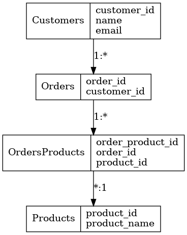

# GUML
Visualize your struct with guml!
# Installation
install graphviz
- [Graphviz](https://graphviz.org/download/)
```sh
go get -u github.com/fanchann/guml
```
# How to use?
```go
package main

import "github.com/fanchann/guml"

type Customers struct {
	CustomerID string `guml:"customer_id"`
	Name       string `guml:"name"`
	Email      string `guml:"email"`
}

type Orders struct {
	OrderID    string `guml:"order_id"`
	CustomerID string `guml:"customer_id"`
}

type Products struct {
	ProductID   string `guml:"product_id"`
	ProductName string `guml:"product_name"`
}

type OrdersProducts struct {
	OrderProductID string `guml:"order_product_id"`
	OrderID        string `guml:"order_id"`
	ProductID      string `guml:"product_id"`
}

func main() {
	cust := Customers{}
	order := Orders{}
	prod := Products{}
	orderProd := OrdersProducts{}

	g := guml.New()

	g.Entity(cust).
		Entity(order).
		Entity(prod).
		Entity(orderProd).
		OneToMany(cust, order).
		OneToMany(order, orderProd).
		ManyToOne(orderProd, prod)

	err := g.Gen("examples")
	if err != nil {
		panic(err)
	}
}
```

this code will generate output



# Author
- [@fanchann](https://github.com/fanchann)
